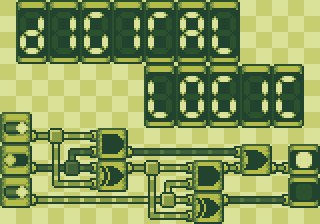

# DigitalLogic
A flash tool for designing simple logic circuits out of basic components.

To do list
-----------------
* Implement the basic functionality for adding and moving around components on a grid.
* List out additional features once that phase is done.